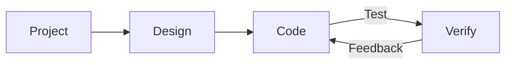

## 五、Cursor智能插件开发实战

Cursor官网开发指导流程：



### 5.1 Cursor设计Chrome浏览器插件

1. 需求设计

   创建：01_chrome插件需求和要求说明

   ``` 
   实现一款Chrome的插件，要包含下面三个功能：
      1. 解释选中的段落或者关键词
      2. 翻译选中的段落或者关键词（支持中文和英文翻译即可）
      3. 朗读选中的段落或者关键字（支持中文和英文朗读）
      4. 润色和替换选中的文本文案
   细节要求：
      1. 当选中段落或者关键词时，出现插件，直接悬浮在选中关键词和段落上！（显示顺序：解释，翻译，朗读，润色）
      2. 解释，翻译，润色的结果直接在悬浮下方出现结果即可
      3. 翻译添加语言选择（翻译目标： 中文还是英文）
      4. 润色结果可以进行修改，同时提供一键替换功能，替换目标文案内容（可编辑情况下可以直接替换）！
      5. 翻译、解释、润色功能实用kimi的api实现即可，具体参考配置kimi api文档
      6. 朗读直接调用chrome浏览器内置插件即可（提供中文和英文朗读）
      7. 并且帮我们写好readme文档，写清在chrome部署插件的过程
   ```

   `https://platform.moonshot.cn/docs`

2. 设计和生成项目ui图文本 

   chat agent模式对话：

   ``` 
   @01_chrome插件需求和要求说明 根据插件需求文档，帮我写一份项目的UI文本设计图，将设计图写到 02_chrome插件UI设计图 文件中！ 要求页面简洁，清晰！
   ```

   生成 02_chrome插件UI设计图

   ``` 
   # Chrome插件UI设计文档
   
   ## 1. 悬浮菜单设计
   
   ### 1.1 基础悬浮菜单
   ​```
   +------------------------+
   |     功能按钮组         |
   +------------------------+
   | [解释] [翻译] [朗读] [润色] |
   +------------------------+
   ​```
   
   ### 1.2 功能展示区域
   ​```
   +------------------------+
   |     功能按钮组         |
   +------------------------+
   | [解释] [翻译] [朗读] [润色] |
   +------------------------+
   |     结果展示区域        |
   |                        |
   |                        |
   +------------------------+
   ​```
   
   ## 2. 各功能界面设计
   
   ### 2.1 解释功能
   ​```
   +------------------------+
   |     功能按钮组         |
   +------------------------+
   | [解释] [翻译] [朗读] [润色] |
   +------------------------+
   |     解释结果           |
   | 选中的文本解释内容...    |
   +------------------------+
   ​```
   
   ### 2.2 翻译功能
   ​```
   +------------------------+
   |     功能按钮组         |
   +------------------------+
   | [解释] [翻译] [朗读] [润色] |
   +------------------------+
   | 目标语言: [中文 ▼]      |
   +------------------------+
   |     翻译结果           |
   | 翻译后的文本内容...      |
   +------------------------+
   ​```
   
   ### 2.3 朗读功能
   ​```
   +------------------------+
   |     功能按钮组         |
   +------------------------+
   | [解释] [翻译] [朗读] [润色] |
   +------------------------+
   | 朗读语言: [中文 ▼]      |
   | [▶ 开始朗读] [■ 停止]   |
   +------------------------+
   ​```
   
   ### 2.4 润色功能
   ​```
   +------------------------+
   |     功能按钮组         |
   +------------------------+
   | [解释] [翻译] [朗读] [润色] |
   +------------------------+
   |     润色结果           |
   | 润色后的文本内容...      |
   |                        |
   +------------------------+
   | [编辑] [替换原文]       |
   +------------------------+
   ​```
   
   ## 3. 设计规范
   
   ### 3.1 颜色方案
   - 主色调：#4A90E2（蓝色）
   - 背景色：#FFFFFF（白色）
   - 文字颜色：#333333（深灰）
   - 边框颜色：#E5E5E5（浅灰）
   
   ### 3.2 字体规范
   - 主字体：系统默认字体
   - 标题：14px
   - 正文：12px
   - 按钮文字：12px
   
   ### 3.3 间距规范
   - 内边距：8px
   - 按钮间距：4px
   - 功能区间距：12px
   
   ### 3.4 交互规范
   1. 选中文本后，悬浮菜单自动显示在选中文本附近
   2. 点击功能按钮后，结果区域自动展开
   3. 鼠标移出悬浮菜单区域，菜单自动隐藏
   4. 所有按钮hover效果：背景色变浅
   5. 编辑区域支持直接修改，替换按钮一键替换原文
   
   ## 4. 响应式设计
   - 悬浮菜单宽度：最小200px，最大400px
   - 高度自适应内容
   - 确保在各种屏幕分辨率下都能正常显示 
   ```

3. 配置和导入kimi docs文档

   配置位置： cursor settings > Features > Docs > add new doc 

   

4. 生成kimi api key

   登录kimi api 用户中心： `https://platform.moonshot.cn/console/api-keys`

   创建kimi api key (第一次赠送15元)：

   

### 5.2 Chrome插件实现

1. 准备一个参考界面（参考豆包）

   

2. 实现插件功能

   ``` 
   @01_chrome插件需求和要求说明 @02_chrome插件UI设计图   基于需求和UI设计图，以及参考 @doubaoui.png 图片风格，直接在当前chrome-plugin文件夹下实现插件功能，同时提取单独配置文件用于填写kimi api url和key的位置！代码添加中文注释，实现后再次自检查，确保插件正常运行和实现功能！
   ```

3. 配置kimi api key 

   ``` config.js
   // API配置
   const config = {
       // Kimi API配置
       kimi: {
           apiUrl: 'https://api.moonshot.cn/v1', // 替换为实际的Kimi API URL
           apiKey: 'YOUR_KIMI_API_KEY'  // 替换为实际的Kimi API Key
       },
       
       // 默认设置
       defaults: {
           translationTarget: 'zh', // 默认翻译目标语言：zh-中文，en-英文
           speechLanguage: 'zh'    // 默认朗读语言：zh-中文，en-英文
       }
   };
   
   // 导出配置
   export default config; 
   ```

### 5.3 Chrome插件调试和发布

1. 第一次回出现问题（使用cursor调试）

   

   ``` 
   将插件文件夹发布到chrome浏览器，报图片的错误，你给我从网上查找几张图片放在对应的位置即可！
   ```

   很大概率，cursor不给我们生成缺少的图片，安全原因，那么就需要我们自己手动添加！！

2. 有错误信息显示

   Uncaught SyntaxError: Cannot use import statement outside a module

   

   ``` 
   Uncaught SyntaxError: Cannot use import statement outside a module 解决错误信息！
   ```

3. 确保添加完成

    

4. 测试功能和调试

5. 实现和测试
